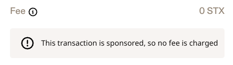

# In-Depth: Sponsored Transactions for Users

Sponsored transactions are defined in [SIP-005](https://github.com/stacksgov/sips/blob/main/sips/sip-005/sip-005-blocks-and-transactions.md#transaction-authorizations). The specification says that the user needs to sign the transaction first and the sponsor second.

## User flow

Practically, the user visits an website (or dapp), connects the Stacks wallet and then initializes a transaction. The wallet shows the transactions as usual with post-conditions etc. However, the fees will be 0 STX for the user.

Leather web extension (version v6.51.1) show 0 STX fees and an information text like this:

The wallet sends the signed transaction back to the website. The signed transaction can now be forwarded to a signing service or an other user who sponsors the transaction. Currently, no Stacks wallet supports signing transactions as a sponsor. Instead, the developers of the website needs to take care of it.

## Benefits and Risks

On one hand, sponsored transactions simplify the interaction with websites or apps that do not require the use of STX directly. Furthermore, users do not have to evaluate the current fee market and decide on the fees.

On the other hand, sponsored transactions create a dependency between user and sponsor. If the sponsor fails to sign and broadcast the transaction correctly, the user's transaction is not confirmed until the sponsor resolves the issue. A bad acting sponsor can even block the user's wallet. See [Block Hacked Accounts](../use-cases/block.md).
