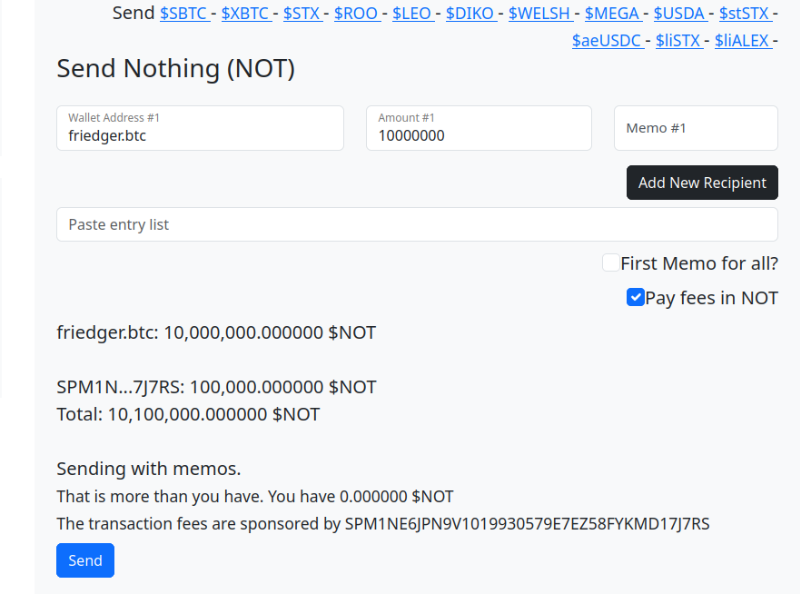

# Send $NOTHING to many users

The website [sendstx.com](https://sendstx.com) helps users to send STX and other tokens to many users with a single transaction. The site uses sponsored transactions.

When sending $NOT tokens users can choose to pay transactions fees in $NOT. (They pay nothing).

## sendstx.com

## Explanation

When the user chooses to pay in $NOT the sponsor address is added as a recipient of the send-many transaction. The amount is currently fixed and should be equivalent to the transactions fees in STX.

The transaction is signed by the user as a sponsored transaction using Leather wallet (or other supported wallets). The returned signed transaction is send to the tx2.app server. The server verifies the transactions. If the transaction is eligable for sponsoring, the server account signs the transaction as sponsor with the keys of the sponsor address and then broadcasts the transaction.

The following criteria are implemented for eligable sponsoring:

- must be a sponsored transaction
- must be a send-many transaction for $NOT
- must contain the sponsor address as recipient

The source code is available at [github.com/friedger/stacks-not-sponsoring](https://github.com/friedger/stacks-not-sponsoring/blob/main/src/lib/stacks.ts#L101).
