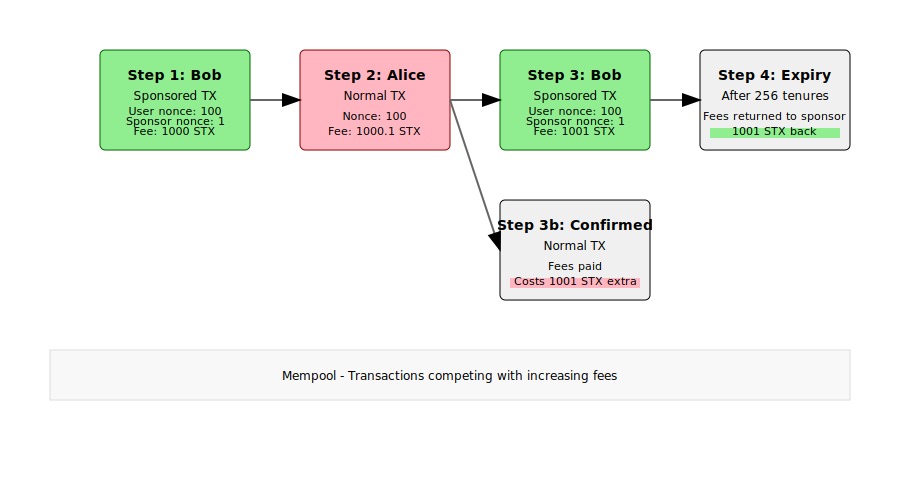

# Block hacked account

Sponsored transactions have been seen in the wild to block a hacked account from doing any further transactions. This is possible due to the dependency between user and sponsor.

When a third party (Alice) has access to the private key of the user's account, the user (Bob) can try to block their own account. The user can initiate a sponsored transaction with the sponsoring account using a nonce with a gap and. This prevents that the user's sponsored transaction is confirmed by the network. The user account cannot send any transactions anymore.

The third party could try to replace the transaction by higher fees. However, the sponsor can do the same. If the user uses a very high fee e.g. 1000x more than usual then it is very expensive for the 3rd party to submit a bad transaction because the 3rd party has to increase the fees even more. For the user the risk is smaller because the sponsor can get back their fees when the transaction in mempool expires after 256 tenures/bitcoin blocks (around 2 days).

Example:

1. Bob sends a sponsored transaction with nonce 100 and with sponsoring nonce 1 from a new sponsoring account and with fees 1000 STX. The first sponsoring account would be 0, not 1. The user's account is blocked.
2. Alice replaces the sponsored transaction with a normal transaction with nonce 100 and with 1000.1 STX fees, e.g. to drain the account. Alice would get 1000 STX less if confirmed.
3. Bob replaces the normal transaction with a sponsored transaction with 1001 STX fees and the same nonces with gap.
4. After 256 tenures the sponsored transaction would expire and the sponsor account can re-use the 1001 STX reserved for the fees.

